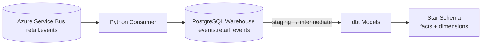

# Retail Analytics

[](https://github.com/elvarlax/retail-analytics/actions/workflows/analytics-ci.yml)

Retail Analytics is an event-driven analytical warehouse for the [retail-inventory](https://github.com/elvarlax/retail-inventory) domain.
The source system publishes business events to Azure Service Bus, this project consumes those events into PostgreSQL, and dbt builds a star schema for analytics.

---

# Architecture

## System Architecture



---

## Warehouse Layers

| Layer            | Purpose                                            |
| ---------------- | -------------------------------------------------- |
| `events`         | Raw event ingestion log (`events.retail_events`)   |
| `staging`        | Typed fields extracted from raw JSONB payloads     |
| `intermediate`   | Reusable joins and analytical convenience columns  |
| `marts`          | Final star schema — facts and dimensions for BI    |

---

# Event Consumer

The consumer listens on:

* Topic: `retail.events`
* Subscription: `analytics-sub`

Supported event types:

| Event                    | Source                                              |
| ------------------------ | --------------------------------------------------- |
| `CustomerCreatedV1`      | Customer registered or seeded                       |
| `ProductCreatedV1`       | Product created or seeded                           |
| `OrderPlacedV1`          | Order placed                                        |
| `OrderStatusChangedV1`   | Order completed or cancelled                        |

Behaviour:

* Creates the `events` schema and `events.retail_events` table on startup if missing
* Inserts one row per message with event type, JSONB payload, source, and timestamps
* Idempotent — `ON CONFLICT (event_id) DO NOTHING` prevents duplicate ingestion
* Completes messages on success
* Abandons failed messages for redelivery
* Dead-letters messages when delivery count reaches `MAX_RETRIES`

---

# Star Schema

## Facts

* `marts.fact_orders` — one row per order
* `marts.fact_order_items` — one row per order line item

Both fact tables are materialized as **incremental** tables, picking up new orders and any status changes since the last run.

## Dimensions

* `marts.dim_customers`
* `marts.dim_products`
* `marts.dim_date`

Example analysis use cases:

* Revenue trend and average order value over time
* Product performance by revenue and units sold
* Customer-level ordering behaviour

---

# Data Quality

dbt tests cover schema integrity and business rules across all layers:

* Key integrity: `unique`, `not_null`, and FK `relationships`
* Domain checks: `accepted_values` for order statuses
* Metric checks: positive amount and quantity expressions
* Business-rule singular tests:
  * `assert_completed_at_after_created_at`
  * `assert_fact_orders_completion_consistency`
  * `assert_positive_line_amounts`
  * `assert_retail_events_recency` — freshness guard for ingestion pipeline

Recency threshold defaults to 168 hours and can be overridden:

```
docker compose run --rm dbt build --vars "{events_recency_hours: 24}"
```

---

# Running Locally

## Prerequisites

* Docker and Docker Compose
* Azure Service Bus connection string (cloud or emulator)

---

## Environment

Create `.env` in the repo root:

```
SERVICE_BUS_CONNECTION_STRING=Endpoint=sb://localhost;SharedAccessKeyName=RootManageSharedAccessKey;SharedAccessKey=<key>=;UseDevelopmentEmulator=true;
SERVICE_BUS_TOPIC=retail.events
SERVICE_BUS_SUBSCRIPTION=analytics-sub
MAX_RETRIES=3
```

---

## Start Warehouse

```
docker compose up warehouse -d
```

---

## Start Event Consumer

```
docker compose up consumer
```

---

## Build dbt Models

```
docker compose run --rm dbt deps
docker compose run --rm dbt build
```

During development:

```
docker compose run --rm dbt run
docker compose run --rm dbt test
```

---

## Generate dbt Docs

```
docker compose run --rm dbt docs generate
docker compose run --rm -p 8081:8080 dbt docs serve --host 0.0.0.0 --port 8080
```

Open: `http://localhost:8081`

---

# Continuous Integration

GitHub Actions workflow: `.github/workflows/analytics-ci.yml`

Pipeline steps:

* Starts PostgreSQL warehouse service
* Installs Python dependencies
* Initialises `events.retail_events` with production schema and indexes
* Runs `dbt deps`
* Runs `dbt build`

---

# Tech Stack

* Python 3.11
* PostgreSQL 16
* Azure Service Bus SDK (`azure-servicebus`)
* psycopg v3
* dbt-postgres
* dbt-utils
* dbt-expectations
* Docker and Docker Compose
* GitHub Actions
